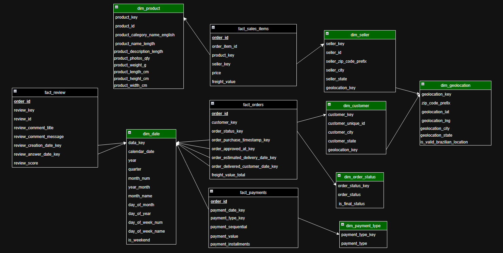

<div align="center">

# Olist E-commerce Data Pipeline


<br>

**Kompletny, skalowalny system ELT (Extract, Load, Transform) symulujący środowisko produkcyjne e-commerce.**

[Kontekst](#-kontekst-i-cele) •
[Technologie](#-zastosowane-wzorce-i-technologie) •
[Architektura](#-architektura-i-przepływ-danych) •
[Uruchomienie](#-instrukcja-uruchomienia)

</div>

---

## 💡 Kontekst i Cele

**Problem:** Surowe dane Olist to rozproszone logi transakcyjne – analiza przychodu, opóźnień czy retencji wymaga łączenia wielu tabel i jest nieefektywna w czasie rzeczywistym.

**Rozwiązanie:** Zautomatyzowany potok danych przekształcający surowe logi w czysty model **Galaxy Schema** (Konstelacja Faktów) w Hurtowni Danych.

### 📚 Dokumentacja Projektu (Live)
Projekt posiada w pełni wygenerowaną dokumentację dbt, dostępną online:
👉 **[Kliknij tutaj, aby zobaczyć Data Lineage i Słownik Danych](https://jakubmajor23.github.io/olist-data-pipeline/)**

### Główne Cele
- **Single Source of Truth:** Centralizacja danych o Zamówieniach, Płatnościach i Produktach.
- **Skalowalność:** Ładowanie przyrostowe (Incremental Loading) dla obsługi rosnącego wolumenu danych.
- **Jakość Danych:** Integralność referencyjna, brak duplikatów (Idempotentność) i testy `dbt`.

---

## Zastosowane Wzorce i Technologie

Projekt realizuje zasady inżynierii danych (**Modern Data Stack**) poprzez:

| Obszar | Implementacja |
| :--- | :--- |
| **Orkiestracja** | **Event-Driven Airflow**: Wyzwalanie DAG-ów przez REST API zaraz po pojawieniu się nowych danych (symulacja). |
| **Modelowanie** | **Galaxy Schema**: Architektura Konstelacji Faktów (3 tabele faktów) eliminująca problem *Fan-out* i iloczynu kartezjańskiego. |
| **Transformacja** | **dbt Core**: Modele zmaterializowane jako `incremental` oraz `table`, makra Jinja (DRY), testy jakości danych. |
| **Jakość Kodu** | **SQLFluff**: Linter SQL zapewniający spójny styl kodu (zgodnie z plikiem `.sqlfluff`). |
| **Infrastruktura** | **Docker & Docker Compose**: Pełna konteneryzacja Airflow (z dbt) oraz bazy danych Postgres. |

---

## Architektura i Przepływ Danych

System zaprojektowano modułowo, oddzielając warstwę symulacji od właściwego przetwarzania.

### Cykl Życia Danych (End-to-End Flow)

Proces symuluje rzeczywiste działanie hurtowni danych w trybie przyrostowym (Incremental Load):

1.  **Symulacja Transakcji (`simulate_production.py`):**
    Skrypt pobiera dane historyczne (miesiąc po miesiącu) i ładuje je do operacyjnej bazy danych (`postgres-olist-source`), zachowując ścisłe więzy integralności (Klienci → Zamówienia → Płatności).

2.  **Trigger API (`run_demo.py`):**
    Natychmiast po załadowaniu danych, orkiestrator wysyła zapytanie POST do REST API Airflow, przekazując `logical_date`. Pozwala to na precyzyjne przetworzenie tylko nowego wycinka czasu.

3.  **Extract & Load (Airflow DAG):**
    * **Idempotentność:** Przed załadowaniem, DAG usuwa z warstwy `raw_data` wszelkie dane dla przetwarzanego miesiąca, zapobiegając duplikatom.
    * **Transfer:** Dane są przenoszone z bazy źródłowej do hurtowni (Raw Layer) przy użyciu wydajnych silników SQLAlchemy.

4.  **Transformacja (dbt):**
    Airflow uruchamia kontener z dbt (`dbt run`). Dane surowe są czyszczone (Staging) i modelowane do postaci tabel faktów i wymiarów (Marts).

5.  **Walidacja (`validate_data.py`):**
    Na samym końcu symulacji (`run_demo.py`) uruchamiany jest skrypt QA. Weryfikuje on integralność danych, porównując liczbę wierszy między oryginalnymi plikami CSV a **bazą źródłową**, aby potwierdzić, że symulacja przebiegła bez utraty danych.

---

## 🛠️ Szczegóły Transformacji (dbt)

Warstwa transformacji została podzielona na dwa etapy zgodnie z dobrymi praktykami Analytics Engineering:

### Warstwa Staging (Raw -> Staging)
* Materializacja jako `incremental` dla dużych tabel (Zamówienia, Płatności) i `table` dla słowników.
* Logika **Fail Fast**: Plik `dbt_project.yml` wymusza testy unikalności kluczy podstawowych.

### Warstwa Marts (Staging -> Facts/Dims)
Model **Galaxy Schema** łączy procesy biznesowe przez wspólne wymiary (*Conformed Dimensions*).

| Tabela Faktów | Opis i Logika |
| :--- | :--- |
| **fact_orders** | Centralna tabela transakcyjna. Agreguje wartości koszyka (`SUM(price)`), koszty dostawy oraz łączy statusy zamówień i recenzje w jeden widok analityczny. |
| **fact_sales_items** | Najbardziej granularna tabela (poziom produktu w koszyku). Pozwala na analizę sprzedaży per Produkt (`product_id`) i Sprzedawca (`seller_id`). |
| **fact_payments** | Analiza przepływów pieniężnych, typów płatności (karta, voucher) oraz rat (`payment_installments`). |

---

## 🌟 Ważne Rozwiązania Techniczne

Projekt implementuje zaawansowane wzorce inżynierii danych, wykraczające poza standardowe kursy ETL.

### 1. Wydajność i Modelowanie (dbt)
* **Eliminacja Fan-out (Galaxy Schema):** Świadoma decyzja o rozdzieleniu danych na 3 tabele faktów (`fact_orders`, `fact_sales_items`, `fact_payments`). Zapobiega to eksplozji kartezjańskiej (powielaniu wierszy) i błędom w agregacji, które wystąpiłyby przy próbie złączenia relacji *One-to-Many-to-Many* w jednej tabeli.
* **Surrogate Keys & Incremental Logic:** Tabela `stg__order_items` nie posiada natywnego klucza głównego. Rozwiązano to poprzez wygenerowanie deterministycznego klucza zastępczego `MD5(order_id || '-' || item_id)` oraz złączenie z tabelą zamówień w celu wydajnego ładowania przyrostowego.
* **Ghost Records (Unknown Members):** Obsługa brakujących kluczy obcych (np. w `dim_products`). Błędne relacje są mapowane do sztucznego rekordu `MD5('unknown')`, co zapobiega utracie danych w raportach przy złączeniach `INNER JOIN`.

### 2. Architektura i Bezpieczeństwo
* **Idempotentność Transakcyjna (Savepoints):** Customowy mechanizm w Airflow (`begin_nested()`) usuwa dane z okresu docelowego przed załadowaniem nowych. Gwarantuje to brak duplikatów i bezpieczny rollback w przypadku błędu.
* **Strategia Fail-Fast:** Pipeline celowo przerywa działanie na starcie, jeśli wykryje brak kluczowych zmiennych środowiskowych (haseł), zapobiegając "cichemu" działaniu na niebezpiecznych ustawieniach.
* **Symulacja Integralności:** Skrypt ładujący dane emuluje system transakcyjny, zachowując kolejność insertów zgodną z więzami Foreign Keys.

### 3. Jakość i Czyszczenie Danych
* **Data Repair (Imputacja):** W warstwie Staging zaimplementowano logikę naprawczą – brakujące daty zatwierdzenia zamówienia (`order_approved_at`) są uzupełniane datą zakupu, z jednoczesnym dodaniem flagi audytowej `is_imputed`.
* **Walidacja Geograficzna (Data Enrichment):** System nie usuwa "sztywno" danych, lecz wzbogaca je o metadane jakościowe. Koordynaty leżące poza obrysem Brazylii otrzymują flagę `is_valid_brazilian_location = False`.
* **Golden Record (Klienci):** Wymiar `dim_customers` wybiera najbardziej aktualny adres klienta, używając funkcji okna do deduplikacji zmian adresowych w czasie.

### 4. Konfiguracja i Użyteczność
* **Code as Configuration (Seeds):** Słowniki (np. statusy zamówień) są zarządzane jako pliki `dbt seeds` (CSV) zamiast być "zaszyte" w kodzie SQL. Umożliwia to analitykom biznesowym aktualizację reguł bez ingerencji w kod inżynierski.
* **Translation Layer:** Produkty są automatycznie tłumaczone i standaryzowane (PT -> EN) poprzez złączenie z tabelą słownikową, co ułatwia globalne raportowanie bez konieczności skomplikowanych instrukcji `CASE WHEN`. 

---

## Model Danych

### Model Galaxy Schema
Projekt wykorzystuje architekturę **Konstelacji Faktów**, gdzie trzy tabele faktów współdzielą wymiary (*conformed dimensions*).

<div align="center">
  
</div>

| Tabela Faktów | Opis i Logika |
| :--- | :--- |
| **fact_orders** | Centralna tabela transakcyjna. Agreguje wartości koszyka, koszty dostawy oraz łączy statusy zamówień i recenzje w jeden widok analityczny. |
| **fact_sales_items** | Najbardziej granularna tabela (poziom produktu w koszyku). Pozwala na analizę sprzedaży per Produkt i Sprzedawca. |
| **fact_payments** | Analiza przepływów pieniężnych, typów płatności (karta, voucher) oraz rat. |


### Kluczowe Decyzje Modelowe
* **Role-Playing Dimensions:** Wymiar `dim_date` łączy się z tabelą `fact_orders` wielokrotnie. Pozwala to na jednoczesną analizę różnych zdarzeń cyklu życia zamówienia (data zakupu, zatwierdzenia, wysyłki, dostawy) przy użyciu jednej fizycznej tabeli kalendarza.
* **Outrigger Dimension:** Wymiar `dim_geolocation` nie jest podpięty bezpośrednio do tabel faktów, lecz do wymiarów `dim_customer` i `dim_seller`. Taka normalizacja redukuje redundancję danych adresowych i zapewnia spójność geograficzną.

---

## 📂 Struktura Projektu

```bash
.
├── dags/                   # Definicje DAG-ów Airflow
│   └── olist_elt_dump_dag.py
├── olist_dbt/              # Projekt transformacji dbt
│   ├── models/
│   │   ├── staging/        # Modele pośrednie (Source & Cleaning, Surrogate Keys)
│   │   └── marts/          # Modele biznesowe (Galaxy Schema, Ghost Records)
│   ├── seeds/              # Pliki statyczne (CSV - lookup tables)
│   └── dbt_project.yml
├── scripts/                # Skrypty pomocnicze
│   ├── run_demo.py         # Orkiestrator symulacji
│   ├── simulate_production.py
│   └── validate_data.py    # Skrypt QA (Quality Assurance)
├── docker-compose.yml      # Definicja infrastruktury
├── .sqlfluff               # Konfiguracja lintera SQL
├── requirements.txt        # Zależności Python
└── README.md
```

---

## Instrukcja Uruchomienia

### Wymagania
* Docker & Docker Compose
* Python 3.10+

### Szybki Start

**1. Konfiguracja Środowiska**
Skopiuj przykładowy plik konfiguracyjny (zawiera domyślne hasła dla środowiska deweloperskiego).
```bash
cp .env.example .env
```

**2. Start Infrastruktury**
Uruchom kontenery bazy danych i Airflow.
```bash
docker-compose up -d --build
```

**3. Uruchomienie Symulacji (Demo)**
Skrypt `run_demo.py` automatycznie:
1. Utworzy wirtualne środowisko (opcjonalnie).
2. Symuluje napływ danych historycznych (miesiąc po miesiącu).
3. Wyzwoli odpowiednie procesy w Airflow.

```bash
# Przygotowanie środowiska Python
python -m venv .venv

# Windows:
.\.venv\Scripts\activate
# Linux / macOS:
source .venv/bin/activate

pip install -r requirements.txt

# Start demo
python scripts/run_demo.py
```

---

## Roadmapa i Status

- [x] **Infrastruktura**: Dockerized Airflow & Postgres.
- [x] **Logika ELT**: Custom Python Operators z transakcyjną spójnością.
- [x] **Transformacja**: Modele dbt Incremental & implementacja Galaxy Schema.
- [x] **Orkiestracja**: Architektura Event-driven poprzez Airflow API.
- [x] **QA**: Automatyczna weryfikacja danych (`validate_data.py`).
- [x] **Dokumentacja**: Hosting `dbt docs`.
- [ ] **BI**: Dashboardy Power BI.

<br>

<div align="center">

**Autor:** Jakub Major

</div>