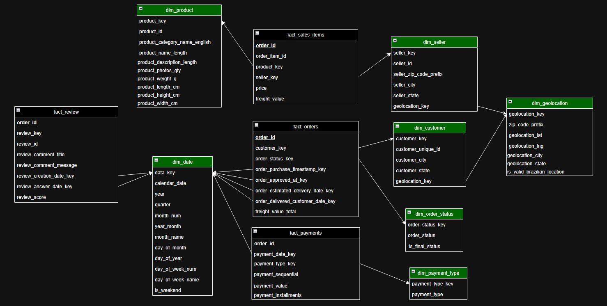
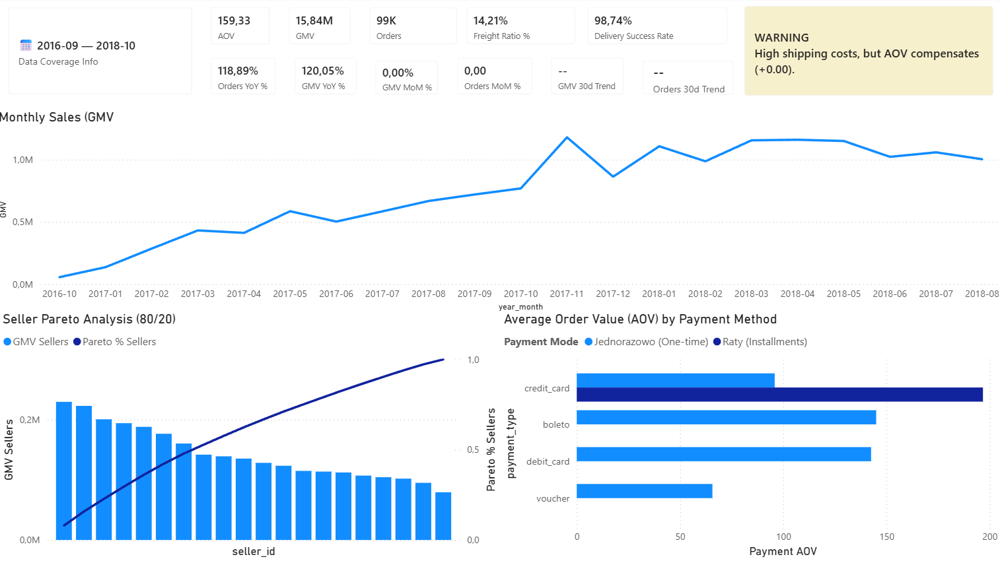
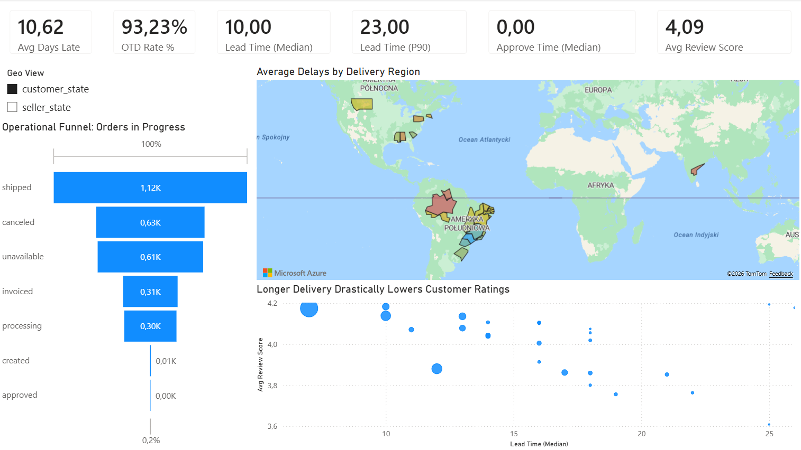
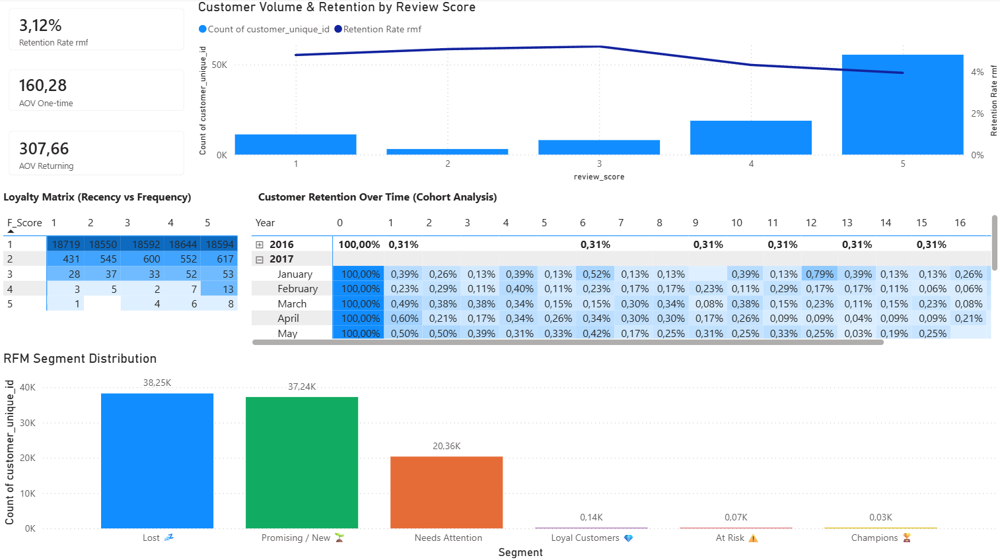

<div align="center">

<p>
  <strong>English</strong> | <a href="README.pl.md">Polski</a>
</p>

# Olist Data Pipeline


ELT project built around the Olist e-commerce dataset. The repository simulates monthly source-system ingestion into PostgreSQL, loads a raw warehouse layer with Apache Airflow, and transforms the data into analytics models with dbt.

**Live dbt docs:** <https://jakubmajor23.github.io/olist-data-pipeline/>

</div>

---

## What This Repository Currently Contains

- A Docker Compose stack with Apache Airflow, a simulated source PostgreSQL database, a warehouse PostgreSQL database, and a separate Airflow metadata database.
- Two Airflow DAGs:
  - `simulate_source_system`
  - `olist_elt_pipeline`
- A dbt project with 20 SQL models:
  - 9 staging models
  - 5 dimensions
  - 2 lookup dimensions
  - 4 fact tables
- Three dbt seed files:
  - `order_statuses.csv`
  - `payments_types.csv`
  - `product_category_name_translation.csv`
- Three custom dbt SQL tests:
  - `assert_delivered_orders_are_approved.sql`
  - `assert_delivered_orders_have_dates.sql`
  - `assert_fallback_members_exist.sql`
- GitHub Actions workflows for Python linting (Ruff), SQL linting (SQLFluff), and dbt docs deployment.
- A Power BI report file committed as `report.pbix`.

## Architecture

### Runtime components

| Component | Current implementation |
| :--- | :--- |
| Orchestration | Apache Airflow `LocalExecutor` in Docker |
| Source layer | PostgreSQL service `postgres-olist-source` |
| Warehouse raw layer | PostgreSQL service `postgres-dwh`, schema `raw_data` |
| dbt target schema | `main` in Docker, `dwh_main_dev` for local dbt runs |
| Metadata DB | PostgreSQL service `postgres-airflow-meta` |
| Transformations | dbt Core with `dbt-postgres` |
| SQL linting | SQLFluff with dbt templater and Postgres dialect |
| Python checks | Ruff linter in CI |

### Pipeline flow

> **Note:** The `simulate_source_system` DAG is not part of the core analytics pipeline. It is purely infrastructure designed to mock the natural behavior of the e-commerce platform's users and simulate the passage of time.

1. `simulate_source_system` runs on a monthly schedule from `2016-09-01` through `2018-12-01`, with `catchup=True`, `depends_on_past=True`, and `max_active_runs=1`.
2. On the first logical month only, it loads static reference data into the source database:
   - products
   - sellers
   - geolocation
3. On every logical month, it loads that month's transactional data into the source database:
   - customers
   - orders
   - order items
   - payments
   - reviews
4. The DAG then triggers `olist_elt_pipeline` with the same `logical_date` and waits for completion.
5. `olist_elt_pipeline` creates the `raw_data` schema if needed, fully refreshes static raw tables, deletes the target month from transactional raw tables, reloads that month, and then runs:
   - `dbt seed --target docker`
   - `dbt run --target docker`
   - `dbt test --target docker`


## dbt Model

The dbt project reads raw Olist tables from the `raw_data` schema and builds a warehouse model in two layers.

### Staging layer

- `stg__customers`
  - normalizes city name (lowercase, trimmed) and state code (uppercase, trimmed)
- `stg__orders`
  - normalizes delivered orders with missing delivery timestamps to status `shipped`
  - imputes missing `order_approved_at` for delivered orders with the purchase timestamp
  - keeps an audit flag `is_approval_date_imputed`
- `stg__order_items`
  - builds a deterministic surrogate key from `order_id` and `order_item_id`
  - loads incrementally by joining to orders for the newly loaded period
- `stg__payments`
  - builds a surrogate key from `order_id` and `payment_sequential`
  - carries `order_purchase_timestamp` for incremental logic
- `stg__reviews`
  - deduplicates by `review_id`
  - keeps the latest `review_answer_timestamp`
  - fills missing text with `No Title` and `No Comment`
- `stg__products`
  - translates product categories from Portuguese to English through a seed join
  - drops rows with missing physical dimensions or weight
- `stg__sellers`
  - casts columns to explicit types for consistency
- `stg__geolocation`
  - removes rows with missing coordinates
  - adds an `is_valid_brazilian_location` flag

### Marts layer

Facts:

- `fact_orders`
- `fact_sales_items`
- `fact_payments`
- `fact_reviews`

Dimensions and lookups:

- `dim_customers`
- `dim_date`
- `dim_geolocation`
- `dim_products`
- `dim_sellers`
- `dim_order_status`
- `dim_payment_type`

Implemented modeling patterns visible in the current SQL:

- `dim_customers` keeps one record per `customer_unique_id`, choosing the latest address by order timestamp.
- `dim_geolocation` aggregates source rows to one record per `geolocation_zip_code_prefix`.
- Several dimensions add fallback members such as `MD5('unknown')` or `MD5('not_defined')`.
- The custom dbt test `assert_fallback_members_exist.sql` checks that those fallback members exist.

<div align="center">
  
</div>

## Quick Start

### Prerequisites

- Docker Desktop or Docker Engine with Compose v2

### 1. Create `.env`

```bash
# Windows PowerShell
Copy-Item .env.example .env

# Linux / macOS
cp .env.example .env
```

The example file defines these default host ports:

| Service | Host port |
| :--- | :--- |
| Airflow web UI | `8080` |
| Source PostgreSQL | `5433` |
| DWH PostgreSQL | `5434` |

### 2. Start the stack

```bash
docker compose up -d --build
```

### 3. Open Airflow

- URL: <http://localhost:8080>
- Default credentials from `docker-compose.yml`:
  - username: `airflow`
  - password: `airflow`

### 4. Run the historical backfill

The intended Airflow entry point is `simulate_source_system`.

- Unpause `simulate_source_system` in the Airflow UI.
- Because the DAG uses `catchup=True`, Airflow will create monthly runs from September 2016 through December 2018.
- Each run loads one month into the source DB and then triggers `olist_elt_pipeline` for the same logical month.

## CI/CD and Documentation

### CI workflow: `.github/workflows/ci_checks.yml`

Runs on:

- pull requests targeting `main`
- pushes to `main`

Current checks:

- Ruff on `dags/` and `scripts/` with `--select E9,F63,F7,F82`
- SQLFluff linting for `olist_dbt/models` from the repository root with the committed `.sqlfluff` config
  - the workflow runs `dbt deps` first so package-based macros resolve exactly as in the project

### Docs deployment: `.github/workflows/deploy_docs.yml`

Runs on:

- pushes to `main`
- manual `workflow_dispatch`

What it does now:

- starts a temporary PostgreSQL 16 service in GitHub Actions
- installs the pinned project requirements from `requirements.txt`
- uses the committed `olist_dbt/profiles.yml`
- runs `dbt deps`
- runs `dbt docs generate --target docker`
- deploys `olist_dbt/target` to the `gh-pages` branch

Live site: <https://jakubmajor23.github.io/olist-data-pipeline/>

## Repository Structure

```text
.
|-- .env.example
|-- .github/
|   `-- workflows/
|       |-- ci_checks.yml
|       `-- deploy_docs.yml
|-- .gitignore
|-- .sqlfluff
|-- dags/
|   |-- olist_elt_pipeline_dag.py
|   `-- simulate_source_system_dag.py
|-- data/
|-- docker-compose.yml
|-- Dockerfile
|-- docs/
|-- init-scripts-olist/
|-- olist_dbt/
|   |-- dbt_project.yml
|   |-- models/
|   |-- packages.yml
|   |-- profiles.yml
|   |-- seeds/
|   `-- tests/
|-- readme_images/
|-- README.md
|-- README.pl.md
|-- report.pbix
|-- requirements.txt
`-- scripts/
    |-- db_config.py
    |-- simulate_production.py
    `-- validate_data.py
```

## Power BI

The repository includes:

- `report.pbix`
- three dashboard screenshots in `readme_images/`

<div align="center">
  
  
  
</div>

<div align="center">

Author: Jakub Major

</div>
